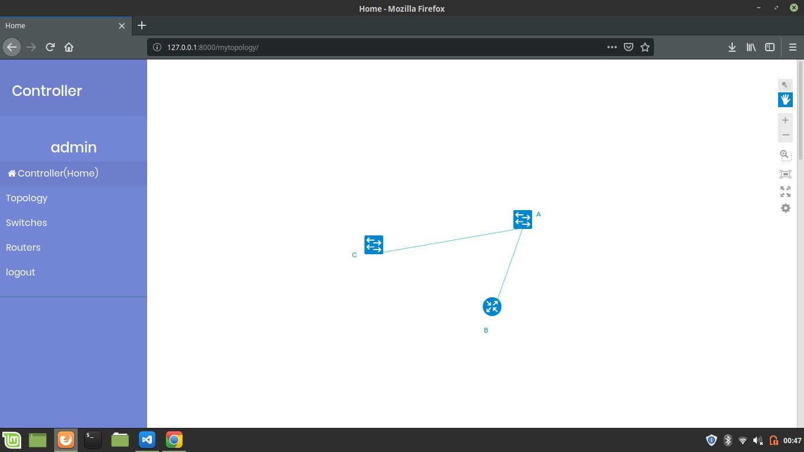
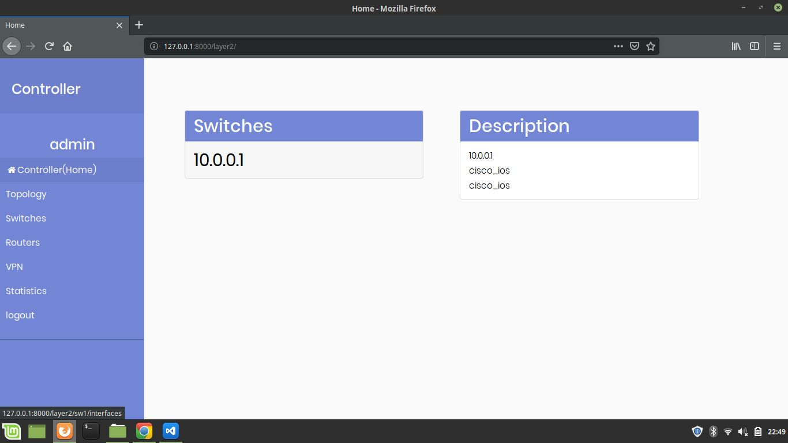
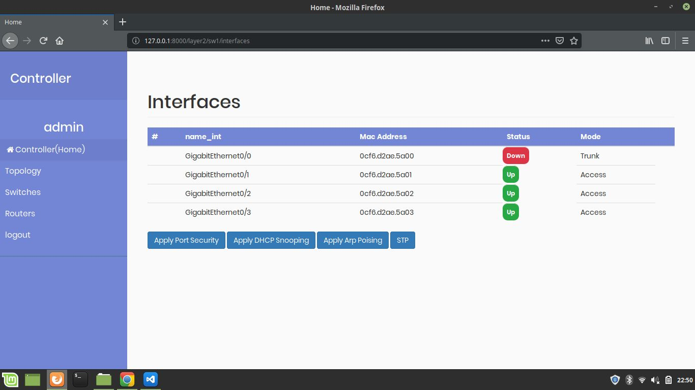
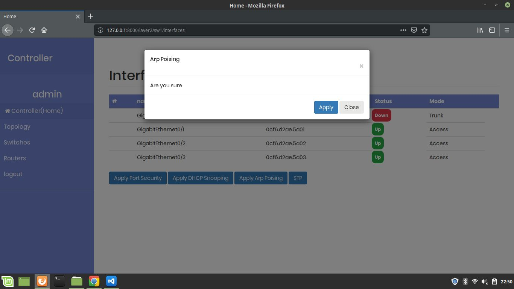
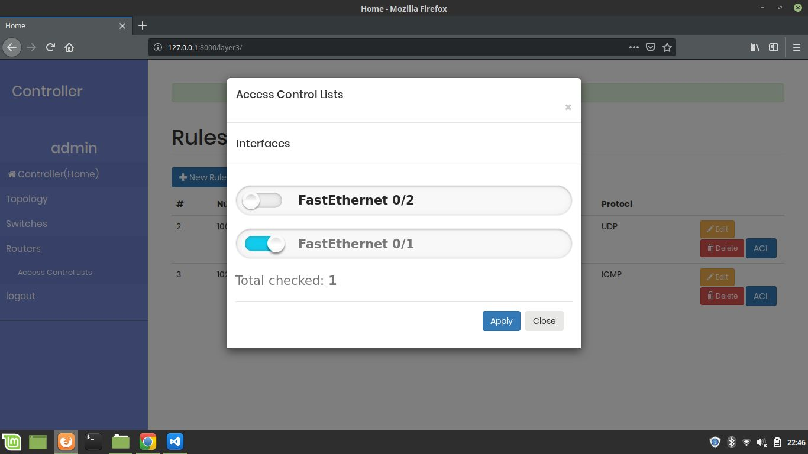
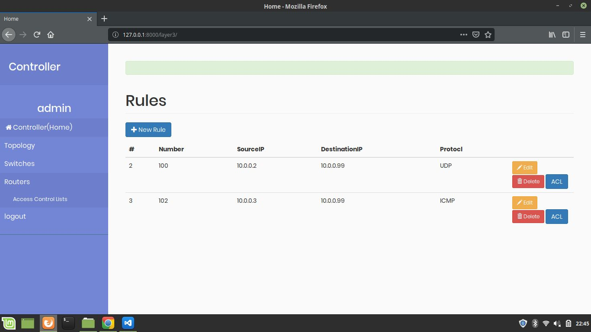
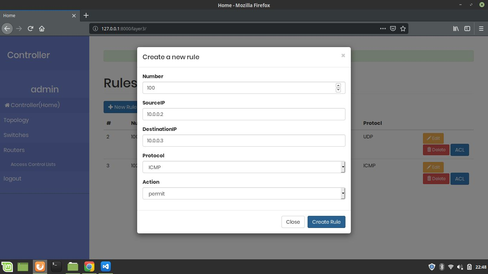
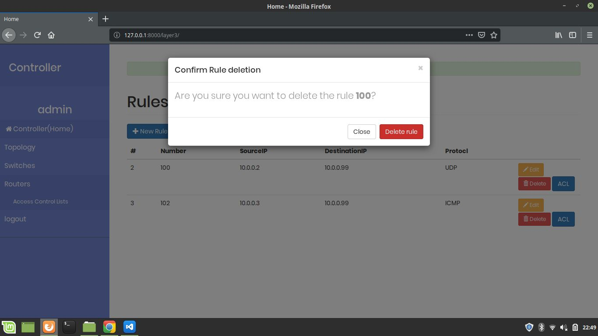
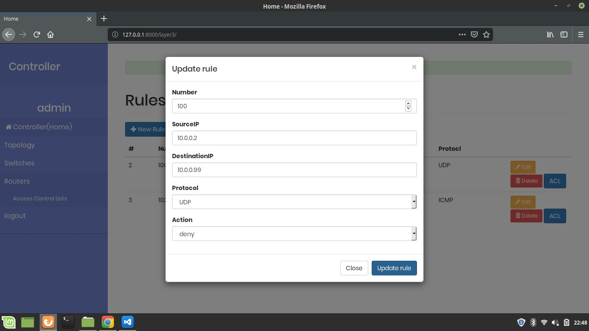

# Network_Security_Automation
This Project is our project for the 4th year at <a href="http://esi-sba.dz/">ESI-SBA</a>. 
This project amais to imporve the scalabilty of the enterprise network by helps network enginners to config and monitor, manage thier entire network, avoiding mistypting commands using web appplication that make it easy.
<h2>Produced by:</h2> 
<ul>
  <li>Garah Abdelhamid</li>
  <li>Attatfa Abdelghani</li>
  <li>Chelouf Soufyane</li>
  <li>Zirari moustafa</li>
</ul>
We created a network topology using emulation tools (GNS3), connected this topology with the controller (developed with Django/Netmiko), and then visualized the topology using CiscoDevNet /NeXt Finally Implement the mitigation against the attack of the layer 2 of the OSI model.
 
<h2>Environment:</h2>
<h3>Language and library used:</h3>
<ul>
  <li>Python</li>
  <li>Django</li>
  <li>Netmiko</li>
  <li>CiscoDevNet/NeXt</li>
  <li>GNS3</li>
</ul>
<h2>Conception:</h2>
 

 

 
<h2>Framework Overview:</h2>
 

